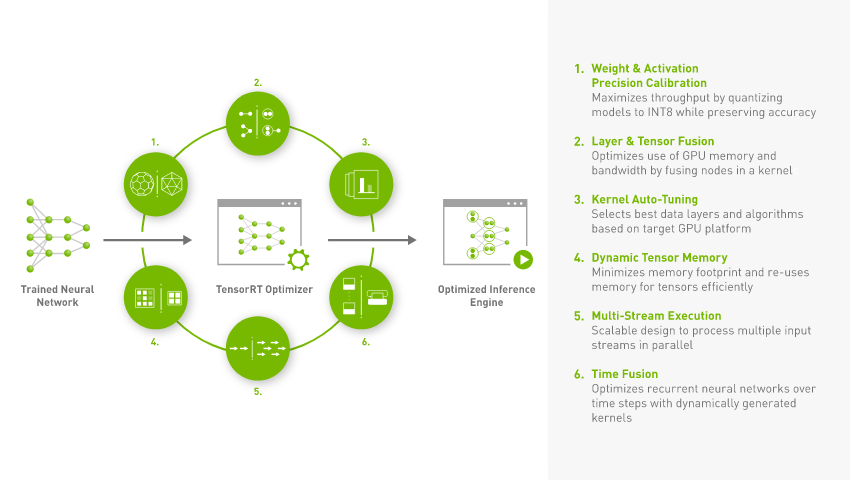

# モデル_CNN選定

AIの学習を行う前に、学習の際に使用するモデルとCNNの選定を行う必要があります。各モデル、CNNには特徴があり、用途に応じて必要なモデルとCNNを使い分ける事で、AIの学習を効果的、効率的に行う事ができます。正しいモデル、CNNを選定できない場合、AIの学習を効果的に行う事ができず、後の工程で問題が生じる事があるので、各モデル、CNNを理解し、適切なものを選定する事が非常に重要です。


### ネットワークアーキテクチャ
画像認識に優れた性能を発揮できるアルゴリズムで、学習において検知したい対象モデルの画像を渡すだけで自動的に学習する仕組みです。これを用いることにより顔認識や、物体検出、画像分類、インスタンス分割、音声認識、時系列、そして信号データなどが可能となります。 <br>
TAO Toolkitは、PeopleNet, TrafficCamNet, DashCamNetなどの各モデルに対して、画像分類、物体検出におけるネットワークアーキテクチャ（YOLOv3, YOLOv4, YOLOv4-tiny, FasterRCNN, SSD, DSSD, RetinaNet, EfficientDet, DetectNet_v2など）と、インスタンス分割におけるネットワークアーキテクチャ（UNetとMaskRCNNなど）をサポートしています。


### TAOでサポートされているネットワークアーキテクチャ


### モデル・CNNの具体的な選定方法
具体的な選定方法として、検知したい対象モデルが人、その人の鞄などを検出したいという場合に関しては、必要なモデルは検知したい物体が人と鞄になります。  
これの検知を行うには、PeopleNetが適しており、CNNはDetectNetが適している為、PeopleNetとDetectNetを選定する、というように目的を達成するために必要な要素を検討し、その要素を満たすことの出来るモデル、CNNを選定します。


### DetectNet
NVIDIA社が提供するTAO-Toolkitに含まれたCNNを用いた物体検出AI用のアプリケーションです。

- resnet18
- resnet34
- vgg16
- vgg19


### PeopleNet
NVIDIAが無料で提供しているDetectNetモデルの内の一つで、3つのカテゴリに含まれる画像中の1つ以上の物理オブジェクトを検出し、画像内の各オブジェクトをボックスで囲むだけでなく、各オブジェクトのカテゴリも表示します。PeopleNetで検出される物体のカテゴリは、人、人の顔、カバンの3つです。このモデルは、NVIDIA DetectNet_v2検出器をベースに、ResNet34を用いてオブジェクトの特徴を認識しています。766万枚の画像でのトレーニングを行なっており、画像や動画両方で使用できるAIモデルとなっています。


### アノテーション
アノテーションとは、音声や画像、テキストといったさまざまな形態のデータに対し、関連する情報（メタデータ）を注釈として付け加えていく作業のことです。AIのモデリングにあたって、独自のAIモデルを使用したり、AIモデルに追加で学習させる場合、学習に使用する教師データにアノテーションを行う必要があります。アノテーションは、通常多くの工数がかかる作業ですが、ツールを使うことで、半自動化することが可能です。アノテーションツールは様々ありますが、GitHubが提供しているlavellmgなどが、YOLOなどのデータ形式に対応しており、おすすめのツールです。当該ツールは、物体検出のためのバウンディングボックス機能や、一度出力したxmlファイルを自動的に再読み込みする機能、別の物体検出システムの出力結果をPascal VOC 形式で保存する機能、等を有しています。

### データ形式
アノテーションファイルには複数のフォーマットがあり、AIモデルの学習ツールごとに別々のフォーマットが指定されています。TAO Toolkit で使用されるフォーマットは、 KITTI 形式と呼ばれるデータ形式であり、本プログラムでは、KITTI 形式を使用します。ほかには、jsonで記述される COCO形式や、xmlで記述される Pascal VOC 形式 などが存在します。

### Kitti
Kittiは、TAO Toolkit で使用されるフォーマットです。  
Kittiがサポートしているアノテーションは、物体検出タスク、鳥瞰図、物体追跡タスクの3つで構成されています。  
例)自動運転をしたい時は、物体追跡タスクに分類されます。  
この物体追跡タスクは、2Dのバウンディボックスの情報だけでなく、各検出対象物体（人や車）のラベルも付与されていて、車クラスと歩行者クラスに関しては全てのピクセルに追跡IDが付与されています。  

##### kitti fileの構成
0: 物体の種類  
1: 物体の画像からはみ出している割合  
2: オクルージョン状態(0->完全に見える, 1->部分的に隠れている, 2->大部分が隠れている, 3->不明)  
3: カメラから見た物体の向き  
4: 2D bounding boxのminx  
5: 2D bounding boxのminy  
6: 2D bounding boxのmaxx  
7: 2D bounding box のmaxy  
8: 3D object dimentionsの高さ  
9: 3D object dimentionsの幅  
10: 3D object dimentionsの奥行き  
11: 3D 物体のx座標  
12: 3D物体のy座標  
13: 3D物体のz座標  
14: カメラ座標系での物体の向き  

具体的なKitti形式のフォーマット例は、以下の通りです。  
```kitti
 Cat 0.00 0 0.0 333.00 72.00 425.00 158.00 0.0 0.0 0.0 0.0 0.0 0.0 0.0 0.0
```

上記の例であれば、物体の種類はCatで、bounding boxの左上の座標は(333.00, 72.00)で右下の座標は(425.00, 158.00)となっています。  
オクルージョン状態は0という数字が与えられているので、完全に猫が見えるという事になります。  

##### 参照
- [https://hirotaka-hachiya.hatenablog.com/entry/2018/02/10/163432](https://hirotaka-hachiya.hatenablog.com/entry/2018/02/10/163432)


##### 参考：COCOのデータ形式
```json
{
    "info": {
        "year": "2022",
        "version": "1",
        "contributor": "",
        "url": "",
        "date_created": "2022-06-14T00:36:30+00:00"
    },
    "categories": [
        {
            "id": 0,
            "name": "cat",
            "supercategory": "YOLOv5s-test"
        }
    ],
    "images": [
        {
            "id": 0,
            "license": 1,
            "file_name": "cat01.jpg",
            "height": 416,
            "width": 416,
            "date_captured": "2022-06-14T00:36:30+00:00"
        }
    ],
    "annotations": [
        {
            "id": 0,
            "image_id": 0,
            "category_id": 0,
            "bbox": [0,0,403,303],
            "area": 122109,
            "segmentation": [],
            "iscrowd": 0
        }
    ]
}
```

##### 参考：pascal VOCのデータ形式
```xml
<annotation>
    <folder>images</folder>
    <filename>cat_100.jpg</filename>
    <size>
        <width>394</width>
        <height>500</height>
        <depth>3</depth>
    </size>
    <segmented>0</segmented>
    <object>
        <name>cat</name>
        <pose>Frontal</pose>
        <truncated>0</truncated>
        <occluded>0</occluded>
        <bndbox>
            <xmin>151</xmin>
            <ymin>71</ymin>
            <xmax>335</xmax>
            <ymax>267</ymax>
        </bndbox>
        <difficult>0</difficult>
    </object>
</annotation>
```