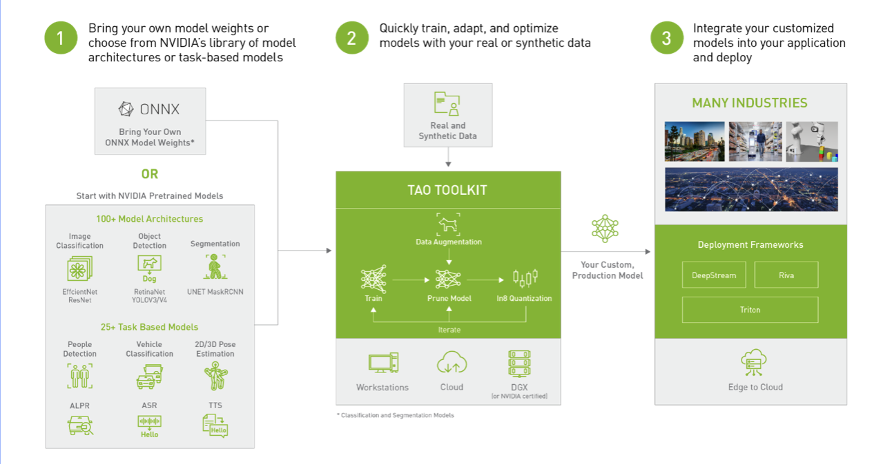
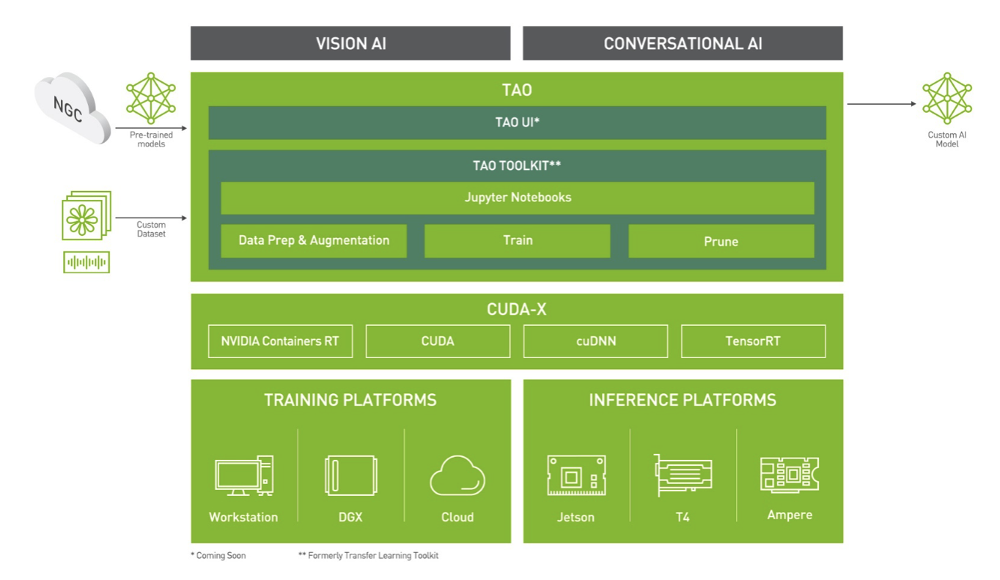
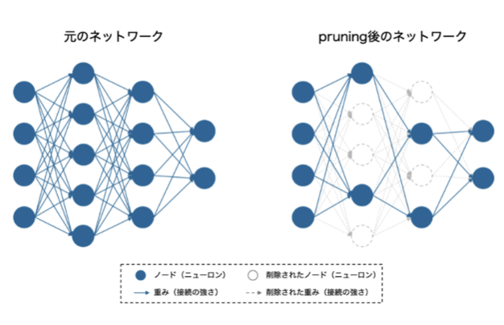
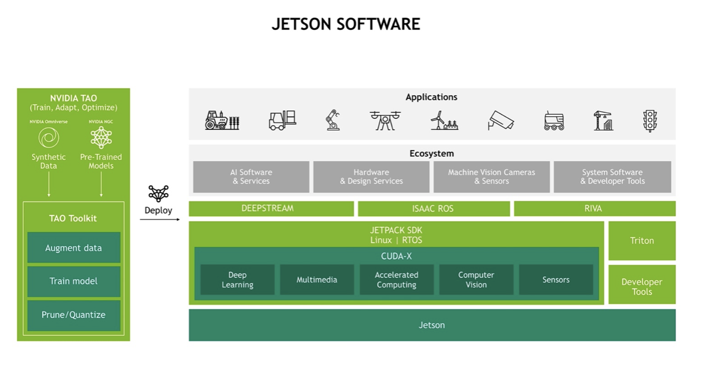

# NVIDIA TAO Toolkitによるモデル最適化
NVIDIA TAO Toolkitにより、NGCで提供されている事前学習されたAIモデルをデバイスへ最適化します。高性能ランタイムであるTensorRT環境において推論を実行するには、環境やハードウェアに最適化されたengineファイルを使用する必要があるため、NVIDIAから提供される各モデルのデータファイルである.etltファイルを用いて、engine ファイルの生成を行います。

### NVIDIA TAO Toolkit
TAOは、Train、Adapt、Optimizeの頭文字をとったもので、事前にトレーニングされたビジョンおよび音声認識用モデル、もしくは独自の重みファイルを活用し、高度なAI モデルの作成を単純化・加速させるツールキットです。膨大なデータセットとデータサイエンティストを揃えて、一からAIモデルを開発するコストを削減し、NVIDIAから提供される事前学習されたAIモデルをそのまま使用することや、短時間で簡単にモデルをカスタマイズすることが可能です。



### NGC
NGCは、AIや機械学習を導入するためのGPUに最適化されたAIモデルなどのコンテナを400種類以上提供しています。  
それらは、全てテストされていて、追加設定なしですぐに連携できるようになっています。  
NGCを活用することにより、AIソフトウェアの最適化にかかる専門知識やモデルの構築にかかる時間などを削減することが可能です。  
NGCでは、物体検出や画像セグメンテーション、等のビジョン向けのモデルと、自動音声認識、テキスト読み上げ等の音声向けのAIモデル（NVIDIA Rivaシリーズ）が提供されており、例えば、以下のようなモデルがあります。
- PeopleNet（人物・顔・鞄検出）
- TrafficCamNet（車、人、道路標識、および二輪車の検出）
- BodyPoseNet（骨格検出）
- BodyPoseNet（骨格検出）
- PeopleSegNet（人物のセグメント検出）
- Speech Synthesis（Riva-テキスト音声合成）
- Speech Recognition（Riva-自動音声認識）
  


### NVIDIA TAO Toolkitのアーキテクチャ(1)



### Jupyter Notebooks(詳細は 07「Jupyterによるモデル化」に記載)
Jupyter Notebooksは、プログラムの記述・実行や、実行した結果の保存・共有を行うことができる、オープンソースのWebアプリケーションです。  
Python、R、Julia、Scalaを含む40を超えるプログラミング言語がサポートしてされており、データの視覚化に優れています。  
NVIDIA TAO Toolkitでは、Jupyter Notebooksが標準パッケージとして備わっており、AIフレームワークの複雑さをシンプルにします。  

### Data Prep & Augmentation  
TAO Toolkitは、NGCから入手可能なTAOコンテナと相互作用し、TAOコンテナには、トレーニングに必要なすべての依存関係がプリインストールされています。  
また、空間変換や色変換などのデータ拡張機能が備わっており、既存の画像データセットを多様化させ、モデルのパフォーマンスを向上させることができます。  

### Train
AIモデルの学習について、TAO Toolkitでは、NGCで提供される400種類以上の、あらかじめ代表的なデータセットでトレーニングされ、重み付けとバイアスによって微調整された、事前学習済みのAIモデルを使用できるため、大規模なデータ収集なしで、高品質なAIモデルを開発することが可能です。また、追加学習の場合でも、既存のネットワークアーキテクチャから学習済みの特徴量を抽出して、わずかな追加の量のデータによって新たなカスタムモデルを作成するなど、短時間で簡単にモデルをカスタマイズできます。

### Prune
ニューラルネットワークにおけるノード間の重みが小さい箇所の接続を切るプルーニング機能が備わっています。  
これによってモデルの全体的な精度にあまり寄与しないニューラルネットワークノードの削除や、全体的なモデルのサイズの縮小、メモリ使用量や計算回数の減少等を行い、モデルの軽量化や処理の高速化などといった効果を実現します。  
この処理は、特にエッジ展開において非常に重要になります。  



### NVIDIA TAO Toolkitのアーキテクチャ(2) 



### NVIDIA TAO Toolkitによるモデル最適化手順
実際に、TAO Toolkitを使用してAIモデルを最適化する手順です。  
ここでは、具体的なモデルとして、NGCで提供されているPeopleNetを用います。  
高性能ランタイムであるTensorRT環境において推論を実行するには、環境やハードウェアに最適化されたengineファイルを使用する必要があるため、NVIDIAから提供される各モデルのデータファイルである.etltファイルを用いて、engine ファイルの生成を行います。	

##### .etltファイル
.etltファイルは、各AIモデルの情報が格納されている、データファイルです。  
NVIDIAのNGC Catalogにおいては、400種類を超えるAIモデルが無料で公開されており、各モデルごとに.etltファイルが提供されています。  
.etltファイルは、そのまま使用しても、TensorRT環境でAIを動作（推論）させることができないため、高速なTensorRT環境で推論を行うために、.etltファイルからengineファイルへの変換が必要です。  
etltファイルは、環境やハードウェアに依存しないため、同一のAIモデルであれば、あらゆる環境、ハードウェアにおいて同じファイルを使用できます。

##### engineファイル
engineファイルは、TensorRT環境の推論において、実際に実行されるファイルです。  
engineファイルは、環境やハードウェアに依存するため、各デバイスごとに生成される必要があります。  
TAO Toolkitにより、例えば、Jetson内にインポートされた.etltファイルを変換し、engineファイルを生成します。

##### PeopleNet
PeopleNetは、ストリーミング画像データから、人、鞄、顔を検出し、バウンディングボックスとカテゴリラベルを付けるAIモデルです。  
PeopleNetは、766万を超える画像と4,130万を超える人物クラスのオブジェクトを含むデータセットでトレーニングされており、混雑した場所でも正確に物体検出を行うことができます。  

##### 1.モデルのダウンロード
以下のダウンロードページ、またはコマンドから、対象のAIモデル（ここでは、PeopleNet）をダウンロードします。  

###### ダウンロードページ
```
https://catalog.ngc.nvidia.com/orgs/nvidia/teams/tao/models/peoplenet/files?version=pruned_v2.0
```
###### ダウンロードコマンド

```
wget'https://api.ngc.nvidia.com/v2/models/nvidia/tao/peoplenet/versions/pruned_v2.0/files/resnet18_peoplenet_pruned.etlt'
```
##### 2.Engineファイルの生成
###### ローカルで実行する方法
任意のデバイス内（ここではJetson）で、以下のコマンドを実行し、.etltファイルからengineファイルに変換します。

```
tao-converter -k tlt_encode -t fp16 -d 3,544,960 -e /path/to/peoplenet.engin \ /path/to/resnet18_peoplenet_pruned.etlt
```
###### ラトナのレポジトリ(Docker)を使用して実行する方法
ラトナではDockerコンテナをエッジ環境にビルドし、Docker内でEngineを作成することができるレポジトリを公開しています。
ラトナのレポジトリを使用してengineファイルを生成する手順は以下の通りです。

2-1.TAO用コンテナをビルドする  
```
make tao-docker-build
```
2-2.TAO用コンテナを建てる  
```
make tao-docker-run
```
2-3.TAO Convertを開始する
```
make tao-convert
```

##### 参照
[peoplenet-on-tao-toolkit](https://github.com/latonaio/peoplenet-on-tao-toolkit)
