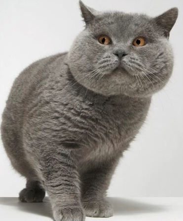
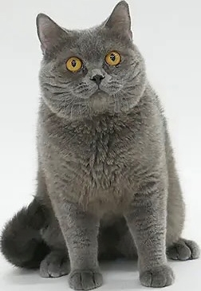
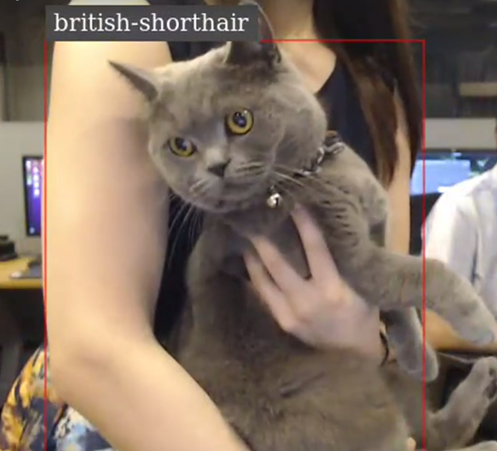

# TAO Toolkitによる追加学習
従来のDeepLearningは事前に学習したデータのみからしか予測できませんでしたが、NVIDIA TAO　Toolkitは学習済みのモデルから新たなAIモデルを作成することが可能です。  
既存のモデルに、検出対象を追加して別のモデルへ変換すること、AIに検出させたいものの画像を追加学習させることでオリジナルのAIを作成することによってこれらを可能としています。

### 参照
[https://developer.nvidia.com/tao-toolkit-usecases-whitepaper/4-add-new-classes-objects-existing-ai-model](https://developer.nvidia.com/tao-toolkit-usecases-whitepaper/4-add-new-classes-objects-existing-ai-model)

### 追加学習の例
追加学習の具体例として、自動運転、工場の自動化（FA）、物流倉庫が挙げられます。自動運転では即時性や高いセキュリティが求められる環境への対応、工場では産業用ロボットのチューニングを学習することによる自動化、物流倉庫では商品の激しい入れ替わりへの対応がそれぞれ可能となります。

### 手順
実際に、NVIDIA TAO　Toolkitを用いて追加学習を行う手順です。  
追加したい検出対象の画像の用意、追加したい検出対象のアノテーション、学習済みモデルの追加学習の三段階で行います。

##### 検出対象の画像の用意
追加して学習させたい画像を用意してください。

##### アノテーション
追加したい画像に対し、検出したい対象の位置やその対象の名前を付与する。  
[labelme](https://github.com/wkentaro/labelme)などのアノテーションツールを使用します。  

- アノテーション画像 <br>
    
    
    


##### モデルの学習
大量の画像から、検出対象の特徴を学習する。TAO Toolkitでは、train、prune、exportの手順が必要となります。  


##### train
学習済みモデルに追加して学習したい画像を学習させ、独自のAIモデルに変換します。  
画像から特徴を学び、ニューラルネットワークの重みを更新するため、画像は１０００枚程度必要です。成果物は tltファイル となります。

### 使用方法
学習時の設定ファイル、学習対象の大量の画像、画像のアノテーションファイルが必要となります。

- 以下のコマンドで学習を開始できます
    ```sh
    tao detectnet_v2 train \
        -e /workspace/tao-experiments/specs/detectnet_train.txt  \
        -r /workspace/tao-experiments/data/trained \
        -k tlt_encode \
        -n resnet18_detector \
        --gpus 1
    ```

- option
    | オプション | 内容 |
    | :------: | :--: |
    | e | 学習時の設定ファイル |
    | r | 学習中の生成ファイルの保存場所 |
    | k | 暗号化用の文字列 |
    | gpus | 使用するgpuの数 |


### prune
追加学習後のニューラルネットワークにおけるノード間の重みが小さい箇所の接続を切り、ノードや重みを削除し、AI動作時のメモリ使用量や計算回数を減少させるため、追加学習後のモデルの軽量化と推論時の処理の高速化が期待できます。追加学習によって作成されたtltファイルから、新たな pruneした後のtltファイルを生成します。

##### 参照
[transfer-learning-toolkit-pruning-intelligent-video-analytics](https://developer.nvidia.com/blog/transfer-learning-toolkit-pruning-intelligent-video-analytics/)


### 使用方法
train で作成された追加学習後のtltファイルが必要となります。

- 以下のコマンドでpruneを開始できます
    ```sh
    tao detectnet_v2 prune \
        -m /workspace/tao-experiments/data/trained/weights/resnet18_detector.tlt \
        -o /workspace/tao-experiments/data/pruned/NEW_PRUNED.tlt \
        -k tlt_encode \
        --gpus 1 \
        -eq union \
        -pth 0.000061
    ```

- option
    | オプション | 内容 |
    | :------: | :--: |
    | m | prune操作の対象のファイル |
    | o | prune実行後のファイル保存場所 |
    | k | 暗号化用の文字列 |
    | gpus | 使用するgpuの数 |


### export
tlt形式のfileをetlt形式のモデルファイルに変換します。

- 以下のコマンドでexportを開始できます
    ```sh
    tao detectnet_v2 export \
        -m /workspace/tao-experiments/data/pruned/NEW_PRUNED.tlt \
        -o /workspace/tao-experiments/data/etlts/NEW_EXPORTED.etlt \
        -k tlt_encode
    ```

- option
    | オプション | 内容 |
    | :------: | :--: |
    | m | export対象のprune済みファイル |
    | o | 実行後のファイル保存場所 |
    | k | 暗号化用の文字列 |

### ラトナのレポジトリを使用したコンテナ内での操作の実行手順 
latonaでは、すべての操作がコンテナ内で行えるように準備したリポジトリを公開しています。
[detection-ai-model-learning-on-tao-tool-kit](https://github.com/latonaio/detection-ai-model-learning-on-tao-tool-kit)

##### 手順

1. annotation済みの画像ファイルを data ディレクトリにコピーする
2. container-login.sh を実行して、コンテナを立ち上げ、ログインする。
    ```sh
    ./container-login.sh
    ```
3. コンテナ内で commands ディレクトリに移動し、train.sh を実行する。
    ```sh
    cd commands
    ./train.sh
    ```
4. prune の実行
    ```sh
    ./prune train
    ```
5. export の実行
    ```sh
    ./export.sh
    ```
6. export が終了したらコンテナからログアウトし、data ディレクトリに `etlts/NEW_EXPORTED.etlt` が新しく生成されていることが確認できる。