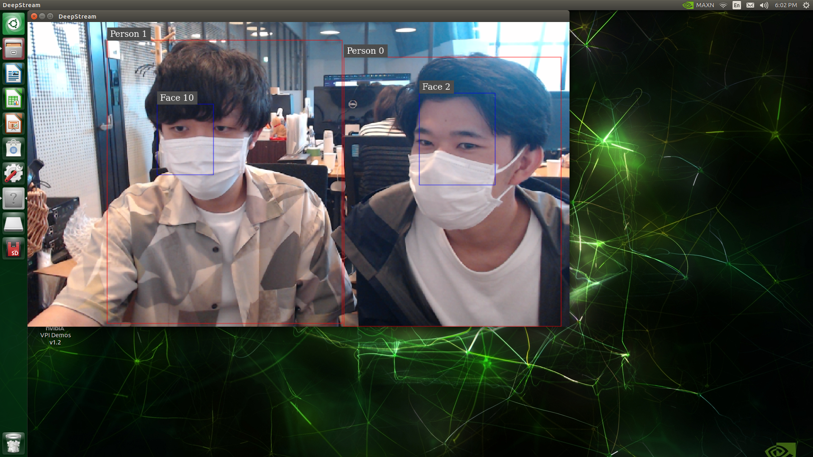
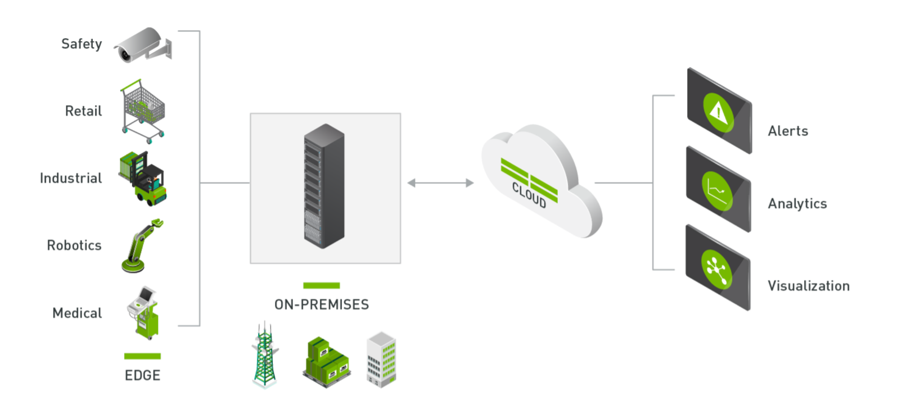
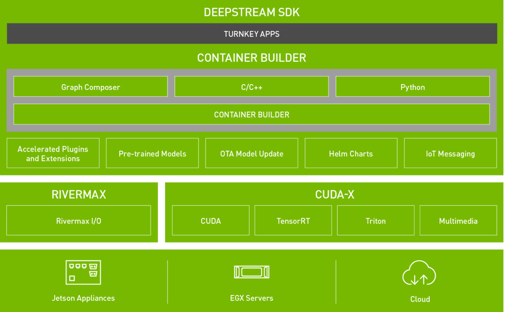

# DeepStreamによる推論

### DeepStream
NVIDIAが提供するAI ベースのマルチセンサー処理やビデオ、音声、画像処理のためのストリーミング分析ツールキットで、TensorRTとGstreamerの2つの技術をメインで使用しています。  
メディアストリーム処理やAI処理に特化した独自のプラグインにより、AI ベースのビデオ解析、音声分析、画像分析のためのシームレスなストリーミングパイプラインを構築することができます。  
物体検出、画像分類、インスタンスのセグメンテーションにおいて卓越したスループットを提供します。  

### GStreamer
メディア処理を簡単に実行するためのフレームワークで、用意されたエレメントをつなぎ合わせることでメディア処理を実行することができます。  

### deepstream-app
Deepstream SDKにおける物体検出、画像分類などを行うための実行プログラムで、Deepstream SDKをインストールした後、/opt/nvidia/deepstream/deepstream-6.0/binから実行ファイルを取得することができます。  
また以下の写真のように、動画ファイルやカメラ入力による動画に対して、物体検出を実行することや、物体に対してバウンディングボックスと呼ばれる枠をつけることもできます。  
 

そして物体検出の結果は、リアルタイムにディスプレイに表示することや動画ファイルとして保存することができます。   



### 動作方法
- `deepstream-app`コマンドにオプションとして設定ファイルを渡す
- command
    ```sh
    deepstream-app -c deepstream_app_source1_peoplenet.txt
    ```

## Latonaのリポジトリで行う方法
- ラトナではDockerコンテナ内で推論を実行できるレポジトリを公開しています。
[github](https://github.com/latonaio/peoplenet-on-deepstream)

1. Dockerコンテナの起動
    - Makefile に記載された以下のコマンドにより、PeopleNet の Dockerコンテナ を起動します。
    ```sh
    make docker-run
    ```
2. ストリーミングの開始
    - Makefile に記載された以下のコマンドにより、DeepStream 上の PeopleNet でストリーミングを開始します。
    ```sh
    make stream-start
    ```
 <br>
 <br>

### C/C++
- 小さいデータで動作可能（コーディングの量が少ない）
- 実行速度が速い
- ハードウェアとの結びつきが強い

### Python
- シンプルで覚えやすい

### CUDA 
- 並列コンピューティングプラットフォーム
- GPUリソースを使用したプログラムの作成が可能

### TensorRT
- ディープラーニング推論を高速に実行するためのソフトウェア開発キット

### Triton
- AI 推論プラットフォーム
- マルチフレームワークのモデルを簡単に展開できる

