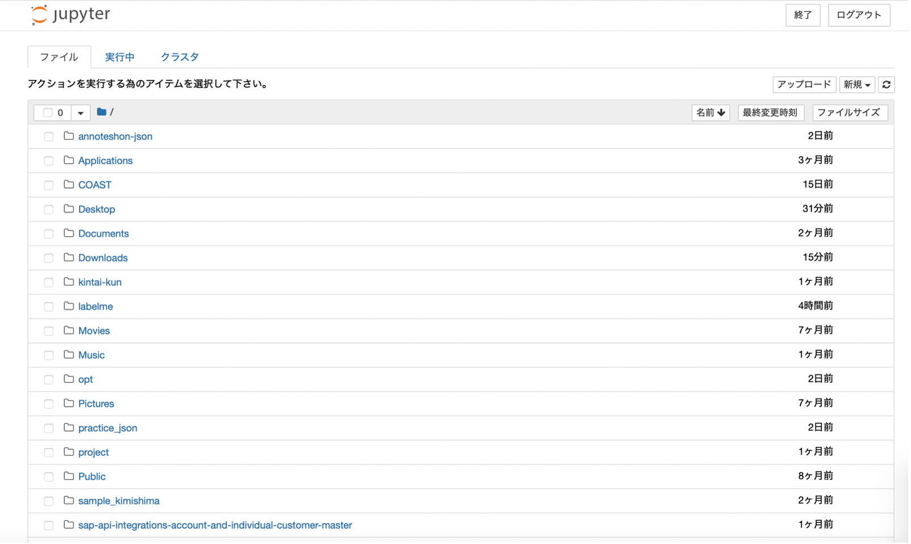
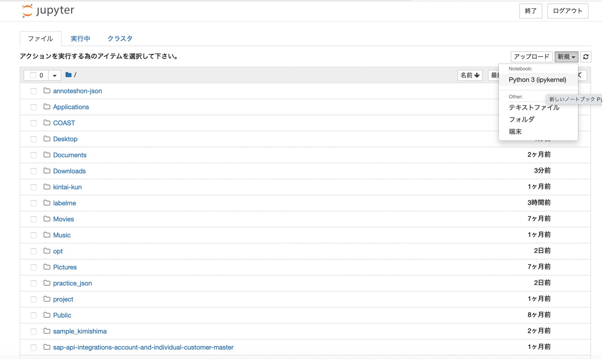
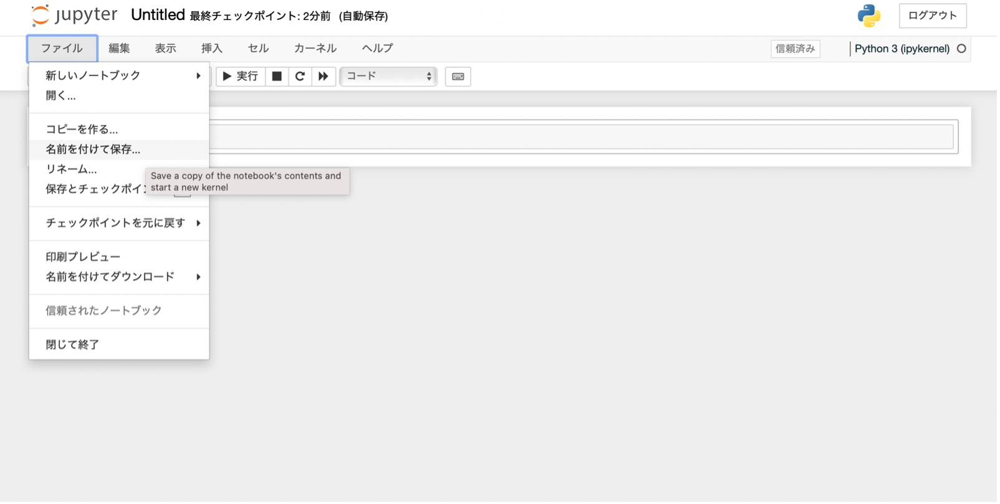

# Jupyterによるモデル化
### Jupyterによるモデル化
jupyter notebook を使用した、モデル生成の方法について説明します。  
•	NVIDIA公式サイトで配布している ipynb ファイルを、jupyter notebook 上で開くと、より詳細な手順を確認することが出来ます。  
[NVIDIA公式サイト](https://catalog.ngc.nvidia.com/orgs/nvidia/teams/tao/resources/cv_samples/version/v1.4.1/files/detectnet_v2/detectnet_v2.ipynb)

### jupyter notebook
Jupyter NotebookはIDE（統合開発環境）です。  
セル単位で実行するため1行コードを書くごとに実行することができ、書いたコードがどのような結果を返すか確認しながらプログラムを作成することが可能です。  
Python、R、Julia、Scalaを含む40を超えるプログラミング言語がサポートしてされており、WEBブラウザ上でそれらの言語を記述、実行することができます。  
NVIDIA TAO Toolkitでは、Jupyter Notebooksが標準パッケージとして備わっています。  

### jupyter notebookのインストール
jupyter notebook を使用した、モデル生成の環境構築として、jupyter notebookのインストールを行います。
pipでインストール可能です。
```
pip install jupyter
```

### 起動方法
- 「jupyter notebook」を実行することで、ブラウザが立ち上がり、jupyter note にログインすることが出来ます。
- 終了
- 実行中のターミナルでCtrl+C すると停止します。

ブラウザ画面
 <br>
ノートブックの作成方法 <br>
ブラウザ画面右上に表示される新規から、追加したいノートブックを選択可能します。
 <br>

- 入力と書かれたテキストボックスにプログラムを打ち込みます。
- プログラムはShift+Enterで実行されます。
- プログラムの作業が終わったら、以下のように左上の"ファイル"から"名前をつけて保存"を選択して保存という流れです。

 <br>
"閉じて終了"をクリックするとノートブックが閉じます。
jupyter-note 起動
nvidia公式 を参考に jupyter-notebook 環境を構築します。
下記がjupyter-note 起動コマンドです。
nohup jupyter notebook --ip 0.0.0.0 --port 8888 --allow-root --NotebookApp.token='' &


### モデル作成方法
1. mount position の設定
    - ec2とcontainerでmountするので、よく考える必要がある。
        - .tao_mounts.jsonの設定が必要。
    - training, prune などの tao command は docker container 内で実行される。
        - 実行時に参照する dir, file の path は、container内の構造で指定する必要がある。
    - container内では作業dir として `/workspace` が用意されている
    - tao_mounts.json の設定例
    ```
    drive_map = {
        "Mounts": [
            # Mapping the data directory
            {
                "source":      os.environ["LOCAL_DATA_DIR"],
                "destination": os.environ["CONTAINER_DATA_DIR"],
            },
            # Mapping the specs directory.
            {
                "source":      os.environ["LOCAL_SPECS_DIR"],
                "destination": os.environ["CONTAINER_SPECS_DIR"]
            },
            # NGC
            {
                "source":      os.environ["LOCAL_NGC_DIR"],
                "destination": "/opt/ngccli/ngc"
            }
        ]
    }
    ```
2. 学習の設定ファイルの用意
specs directory に用意されたサンプルを参考に、学習の際に使用するパラメータを設定します。設定値は学習させる対象や、画像の大きさ、枚数等によって異なります。
ラトナで使用している設定ファイルは、以下のレポジトリにおいて、オープンソースとして公開しています。
[detection-ai-model-learning-on-tao-tool-kit](https://github.com/latonaio/detection-ai-model-learning-on-tao-tool-kit/tree/main/specs)


