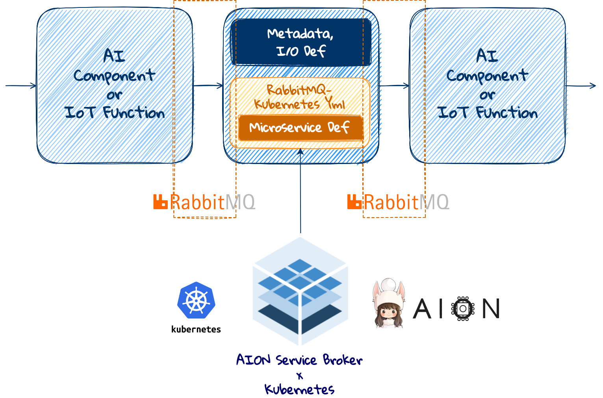

# メッセージングアーキテクチャの適用
AIコンテナを含めた、各マイクロサービス間において、メッセージングアーキテクチャとしてRabbitMQを適用する方法を説明します。  
ラトナにおいて、メッセージングアーキテクチャとしてのRabbitMQは、C/C++、Python、Golang、Node.jsランタイムに適用が可能なように開発されています。  

### RabbitMQ
RabbitMQは、コンピューティングリソースとストレージリソースが制限されたエッジ環境で、1秒間に数百万回のタイムサイクルでエンドポイントにおけるマイクロサービス間の効率的・安定的処理をつかさどる、軽量なメッセージングアーキテクチャです。  
ラトナでは、RabbitMQが、KubernetesのPodとして動作するよう、開発を行っています。 

### RabbitMQによるデータパイプライン
下記の図は、AION™、Kubernetes環境においてRabbitMQがAI/IoT環境のデータパイプラインのコアとして、マイクロサービス間のメッセージング処理を担うアーキテクチャを示したものです。  
データパイプラインにおけるマイクロサービス化された RabbitMQ は、他のコンポーネントと疎結合されており、軽量なメッセージングアーキテクチャとして、AI / IoT ランタイムの I/Oに対して高速で安定的なシステム環境の構築を実現します。



###  RabbitMQの設定とKubernetes上における構築 
RabbitMQを、KubernetesのPodとして動作させるための、設定と構築を行います。  
必要となる設定項目はサーバーのIP、ポート、キュー名、バーチャルホスト名、ユーザー名、パスワードの６項目です。  
- yaml ファイル
- 次の設定ファイルを kubernetes に登録することで rabbitMQ server container が起動します。

```
apiVersion: apps/v1
kind: Deployment
metadata:
  labels:
    run: rabbitmq
  name: rabbitmq
spec:
  replicas: 1
  selector:
    matchLabels:
      run: rabbitmq
  strategy:
    rollingUpdate:
  template:
    metadata:
      labels:
        run: rabbitmq
    spec:
      hostname: rabbitmq
      containers:
      - name: rabbitmq
        tty: true
        image: rabbitmq:3.9.11-management-alpine
        imagePullPolicy: IfNotPresent
        ports:
        - containerPort: 5672
        volumeMounts:
        - name: rabbitmq-data
          mountPath: /var/lib/rabbitmq/mnesia
      volumes:
      - name: rabbitmq-data
        hostPath:
          path: /var/lib/aion/default/Data/rabbitmq

```

### RabbitMQ を設定しKubernetes上 の pod として動かすためのラトナのレポジトリ
[rabbitmq-on-kubernetes](https://github.com/latonaio/rabbitmq-on-kubernetes)

##### 接続
サーバのIP、ポート番号、バーチャルホスト名、ユーザー名、パスワードを指定する必要があります。
参考となるソースコードは以下の通りです。

```
rabbitmq_cli myMetaData::MHPMetadata::cli = new_rabbitmq_client("192.168.128.185", 32094, "AI", "guest", "guest");
```

##### 送信
接続先のキュー名、json や yaml など送信するデータの形式（独自形式でも可）、時刻やフレーム番号、検出した物体の位置情報など送信するデータの内容の３つを決定します。  
また、キューは、サーバー側でも定義してある必要があります。
参考となるソースコードは以下の通りです。

送信データの作成
```
	for (uint32_t y = 0; y < s_h; y++)
	{
		for (uint32_t x = 0; x < s_w; x++)
		{
			float p_max = -100000.0f;
			int c_max = -1;

			for (int c = 0; c < s_c; c++)
			{
				// skip ignoreID
				if (c == ignoreID)
					continue;

				// check if this class score is higher
				const float p = scores[c * s_w * s_h + y * s_w + x];

				if (c_max < 0 || p > p_max)
				{
					p_max = p;
					c_max = c;
				}
			}
			classMap[y * s_w + x] = c_max;
		}
	}
```
送信
```
	myMetaData::MHPMetadata mdata;
	mdata.BuildJSON(classMap,s_w,s_h);
```

### RabbitMQを適用するためのラトナのリポジトリ
ラトナでは、ランタイム毎に rabbitMQ に接続するためのパッケージをgithub上で公開しています。  

- C、C++（https://github.com/latonaio/rabbitmq-c-client)
- Python (https://github.com/latonaio/rabbitmq-python-client)
- Golang (https://github.com/latonaio/rabbitmq-golang-client)
- Node.js (https://github.com/latonaio/rabbitmq-nodejs-client)

