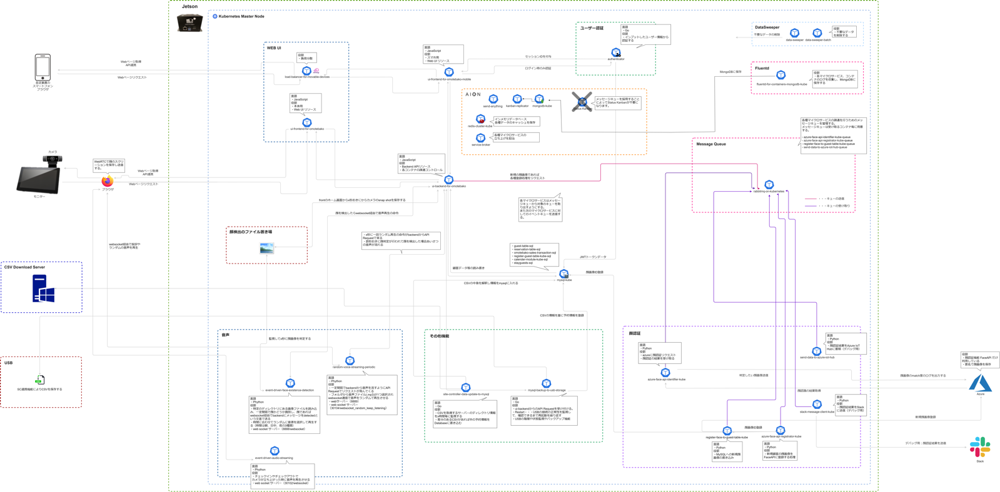

# マイクロサービスによるレポジトリ化

### マイクロサービスアーキテクチャの概要
Latonaはマイクロサービスに力を入れており、すべてのサービスをコンテナ化、レポジトリ化し、オープンソース化しています。  
マイクロサービスアーキテクチャは、サービスを構成する各要素を、独立した小さなコンポーネントとして実装します。  
個々のマイクロサービスは他のマイクロサービスに依存せず起動します。また、独立してデプロイやアップデートが可能であり、スケーラビリティや可搬性に優れています。

### AIONにおけるマイクロサービスアーキテクチャ
AIONにおけるマイクロサービスアーキテクチャは、Kubernetes / Docker / Aion-Core をベースとした包括的なマイクロサービス環境だけでなく、RabbitMQ、Fluentd、Redis、Envoy、ReactJS、MongoDB、MySQL 等の周辺リソースの技術とフレームワークをフル活用した、360°マイクロサービスアーキテクチャの環境を採用しています。  
これにより、大きな単位のサービス管理だけでなく、真に細かく刻まれたレベルにおいてのマイクロサービスの開発実行環境を実現することが可能です。  
また、これらのマイクロサービス環境は、他の全てのコンポーネントやマイクロサービスと、疎結合できるように設計されています。  

### Kubernetes の Pods を マイクロサービスメッシュにした 新生アーキテクチャの概念
AIONでは、Kubernetes Pods と Aion-Core の Service Broker をコアとして、洗練された新生のマイクロサービスメッシュアーキテクチャが実現されています。  
aion-core-manifestsや、aion-service-definitions等により、洗練されたフォーマット定義で標準化されたマイクロサービスの定義ファイルが設定され、複雑なアプリケーション環境においても、ソースコードの開発、デプロイ、メンテナンスを簡単に行うことができます。

### 今までの Kubernetes による マイクロサービスメッシュアーキテクチャ

### AION と Kubernetes を組み合わせた 新しいマイクロサービスメッシュアーキテクチャ
Kubernetes に加えてAION のアーキテクチャを実装することにより、次の機能・環境が付加されます。

- Service Brokerage （主に Service Broker による機能）
- Microservice Mesh （Kubernetesだけでは制御/管理/維持が非効率な Micoservice Mesh の機能）
- Micro-Messaging Tools (Service Broker と RabbitMQ の組み合わせによるMicroservice Level の メッセージングツール）
- Stabilization of Complex Microservicized Architecture (複雑なマイクロサービスアーキテクチャでも安定化する機能）
- Dedicated to Edge Computing Environment (エッジコンピューティング環境に最適化 ※クラウド環境でも適用可能）

### AIONにおけるマイクロサービスアーキテクチャコンセプト
AIONプラットフォームにおける主要機能であるKanbanシステムは、エッジネットワークの多数のインスタンスとのスケーラブルなデータ処理を実現します。主要機能であるAPIゲートウェイがなくても、それぞれのマイクロサービスはKanban data brokerと共に自動的に動作し、データ転送のロジスティックコストを削減します。

### AIONにおけるマイクロサービスアーキテクチャの例（エッジアプリケーション OMOTE-Bako のアーキテクチャ）
以下のアーキテクチャ図において、それぞれのレポジトリ名(例：service-broker, rabbitmq-on-kubernetes, fluentd-for-containers-mongodb-kube, redis-cluster-kube, mysql-kube, data-sweeper-kube, ui-frontend-for-omotebako, ui-backend-for-omotebako, load-balancer-for-movable-devices, azure-face-api-identifier-kube)
で表現された単位が、マイクロサービスの単位です。  
このように、各マイクロサービスはコンテナ化され独立して動作しており、コンテナオーケストレーションシステムのKubernetesによって制御・監視されています。  
なお、各マイクロサービス間は疎結合しており、メッセージングアーキテクチャのコアであるRabbitMQ等によってマイクロサービス間のやりとりが行われています。   

### レポジトリ
Latonaでは2つのgitクラウドレポジトリを下記のように使い分けることによって、CI/CDサイクルの高速化を図っています。  

* GitHub：OSS公開用 
* Bitbucket：開発用

### オープンソースの公開
Latonaでは、ソースコードをオープンソースの形で公開されています。  
誰もがアクセス可能かつ、マイクロサービスアーキテクチャに基づく、分かりやすいサービス開発を行なっており、世界トップクラスのオープンソースのレポジトリ公開数を誇っています。  
オープンソース化は、当該技術の真似をする場合にはMITライセンスに従わなければならないという縛りを明示的に設けることも可能になります。従って、知財・技術の参入障壁としても機能させることができます。  
 

