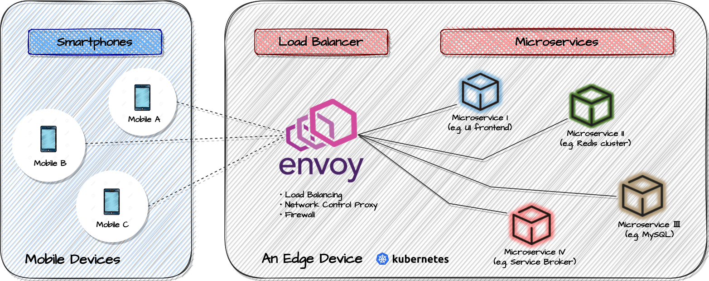

# Envoyロードバランサー
Envoyは、クラウドネイティブアプリケーション向けに設計されたオープンソースおよびサービスプロキシです。  
元々Lyftで構築されたEnvoyは、単一のサービスとアプリケーション向けに設計された高性能C++分散プロキシであり、大規模なマイクロサービス「サービスメッシュ」アーキテクチャ用に設計された通信バスと、現代的なサービスメッシュやエッジゲートウェイのための「ユニバーサルデータプレーン」によるトラフィックコントロールを提供します。ラトナおよびAIONは、エッジコンピューティング上のマイクロサービスアーキテクチャにおいて、ロードバランサー、ネットワーク制御プロキシとして、Envoyをaion-coreならびにKubernetes環境上で採用しています。

### Envoyロードバランサーを用いたエッジコンピューティングアーキテクチャ
以下の図は、Envoyロードバランサーを用いたエッジコンピューティングアーキテクチャです。
本アーキテクチャにおいて、Envoyは外部の複数のモバイル端末からのネットワーク通信と、エッジ端末内における指定されたサービスとのネットワーク通信の制御仲介を行なっています。




### Envoyの設定
ラトナのコアリソースである、aion-coreと、aion-coreの周辺環境を整備するaion-core-manifestsでEnvoyの設定を行います。

・[aion-core](https://github.com/latonaio/aion-core)  
・[aion-core-manifests](https://github.com/latonaio/aion-core-manifests)


以下の部分を、必要に応じて書き替えてください。
```
aion-core
- pkg/k8s/pod.go
- template/envoy.yaml

aion-core-manifests
- template/bases/service-broker/deployment.yml
- template/bases/status-kanban/deployment.yml
- template/bases/kanban-replicator/deployment.yml
- template/bases/send-anything/deployment.yml
- Makefile
```
例えば、aion-core-manifests/template/bases/service-broker/deployment.ymlには、初期値で下記のように記載されています。
```
     - name: envoy
          image: envoyproxy/envoy:v1.16-latest
          imagePullPolicy: IfNotPresent
          command:
            - "/usr/local/bin/envoy"
          args:
            - "--config-path /etc/envoy/envoy.yaml"
          resources:
            limits:
              cpu: 20m
              memory: 512Mi
            requests:
              cpu: 5m
              memory: 64Mi
          ports:
            - containerPort: 6379
              name: envoy-redis
            - containerPort: 10001
              name: envoy-admin
            - containerPort: 10000
              name: envoy-grpc
          volumeMounts:
            - name: envoy
              mountPath: /etc/envoy
      volumes:
        - name: envoy
          configMap:
            name: envoy-config-servicebroker
        - name: config
          hostPath:
            path: /var/lib/aion/default/config  
```
